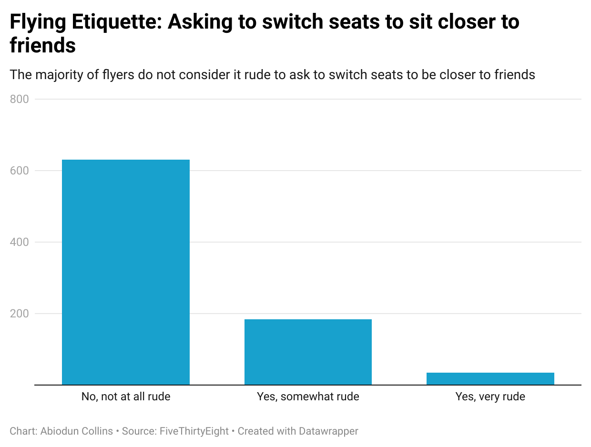

# my-datajournalism

## Would you consider it rude if a passenger on a plane asked to switch seats in order to sit next to a friend?

The reason I picked this question is because I was curious to see how people value friendship and if they are willing to allow freidns enjoy their flights even though it might be of minor inconvenience 

## My reaction to the findings 

I find it interesting that majority of people don't find it rude if poeple to request a seat change in order to sit with their friends. This is because U.S. is unique for having a lot of conflicts in planes with issuees related to seatings, as reported by many mainstream 

This is a chart I made based on the class lecture and data set provided

